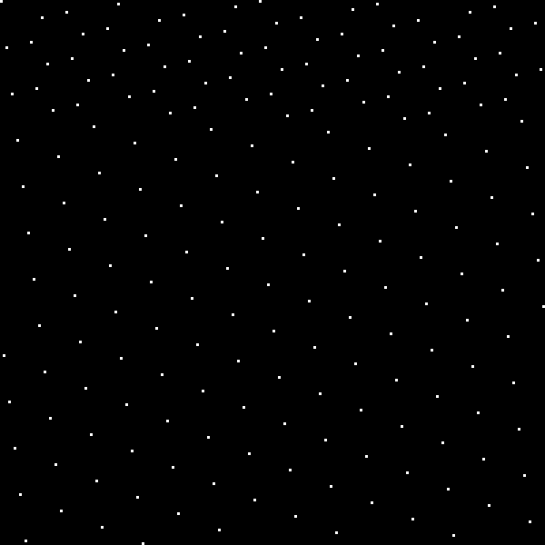

# Fast Uniform 2D Sampling

Chris Lomont, 2024

I recently wanted to take samples from 2D images that satisfied certain properties; this note details the solution. 

I wanted:

1. As I added more and more samples, they would eventually cover the entire image, with no repeats.
2. Given the index of the $i^{th}$ sample, it could generate the pixel coords $(x_i,y_i)$ with very little computation.
3. The samples cover the image "nicely". Nicely is to be determined below.

For a 1-dimensional array, 1 and 2 are pretty easy to do nicely: for an array of size N, choose an integer spacing $\Delta$ so that $GCD(N,\Delta)=1$. Then the samples  $i\Delta\pmod N$ for $i=0,1,...,N-1$ cover the array. Changing the spacing allows making jumps farther apart. I often **start with**  $\Delta=\lfloor N(\phi-1) \rfloor$ where $\phi-1=0.61803398875$ is from the [Golden Ratio](https://en.wikipedia.org/wiki/Golden_ratio). This spacing is also called Fibonacci from [low discrepancy sequences](https://en.wikipedia.org/wiki/Low-discrepancy_sequence). Then while $GCD(N,\Delta)\neq 1$, add one to $\Delta$ to **ensure it is relatively prime** to $N$. Thanks to some number theory, this finds a solution very quickly.

For the use I wanted, I only wanted to sample a tiny fraction of pixels, with the ability to sample more pixels later if I wanted. The low count was for performance (doing math on every pixel of a 4K video frame is costly, doing it for 1000 pixels chosen nicely cuts down work tremendously). So the GCD trick satisfies 1 and 2 pretty nicely as follows:

For an image of width $w$, height $h$, with number of pixels given by the area $A$, suppose I want $s$ samples. Choosing a spacing $\Delta=\lfloor A(\phi-1)\rfloor$ allows taking sample pixels give by $(x_i,y_i)=(s_i\pmod w, \lfloor s_i/w\rfloor\pmod h)$ for $s_i=i\Delta$ for $i=0,1,2,..,s-1$. Then a parallel piece of code, like a GPU shader or even a single loop, can quickly compute a sample location given the index $i$. 

This mostly works, and can look like



The above image is 200x200 pixels, has 200 samples, and $\Delta=243$. Call this a (200,200,200,243) image where this is (width,height,samples,delta).

But, if you're unlucky with the delta, say a very similar $\Delta=241), it can look bad like 


This (200,200,200,241) image doesn't seem to use spacing as well as the first one.

Note also that the samples wrap around bottom to top, so there is a second "set" of samples starting down the image.


This note derives an efficient method to find that look like the former.

To start, let's find the smallest "cell" in the samples:


From this we decide we want the ratio of cell edge lengths to be near 1.0. But this too can fail (200,200,115,349). This has cell edge ratio 0.926. So we'll also require the edges to be somewhat close to 90 degrees.


I spent some time trying to derive an analytic solution from the problem (given width, height, number of samples, find a nice delta), but could not. I spent some effort looking through academic literature to find a solution, but did not find one. Then tried to design an efficient and robust solution, and was lucky to find one.

The first problem is how to find the cell edges. Computing the points and searching through them is far too costly. However the pattern of dots forms a 2D lattice (in the pure math definition), and there is an efficient algorithm (the [Lagrange-Gauss algorithm](https://en.wikipedia.org/wiki/Lattice_reduction)) to compute a nice cell like the above given a basis of the lattice. 

So how to compute a basis (and this MUST be a basis in the true mathematical sense). I took the first basis vector $b_1$ to be the first point corresponding to be the vector from the 0th and 1st samples ($(0,0)$ to $(x_1,y_1)$ in above notation). Thus $b_1=(x_1,y_1)$. To find $b_2$, I search through vectors $(x_k,y_k), k\geq 2$ until I get one that is not a multiple of $b_1$. Then it is linearly independent. To ensure it is also not a multiple of some other vector (before points wrap around the bottom of the image), I started with a small delta (derived below). Then you can prove that $b_2$ is not a multiple of some other vector, otherwise it would have been found for a smaller $k$ value. These initial bases in the above images are in red:


The next part is how to find a good delta. For this consider each cell uses on average about one sample (4 corners per cell, each corner in 4 cells). So given $A=w\times h$ and desired $s$ samples, so we'll take a sample each $\Delta=\lceil A/s\rfloor$ pixels. This way the samples will cover the image approximately once.

Then we check if $\Delta$ meets the required items

1. $GCD(A,\Delta)=1$
2. Basis of minimal cell has high edge ratio and angle ~ 90 degrees.
3. If not, find next $\Delta$, repeat.

From testing, testing 10 or so $\Delta$ values meeting 1 seems to find good results.

Applying to the above (200,200,200,_) image yields best delta 221, ratio 1.0, and image 


Two final examples, for 2048 samples from a 720x1080 image (0.26% of total pixels), this finds delta 391 and image 


Two final examples, for 2048 samples from a 1080x1920 image (0.10% of total pixels), this finds delta 1049 and image

Finally, C++ code to compute these items.

```C++
//
//  Copyright 2024 Chris Lomont
//
//  Permission is hereby granted, free of charge, to any person obtaining a
//  copy of this software and associated documentation files (the "Software"),
//  to deal in the Software without restriction, including without limitation
//  the rights to use, copy, modify, merge, publish, distribute, sublicense,
//  and/or sell copies of the Software, and to permit persons to whom the
//  Software is furnished to do so, subject to the following conditions:
//
//  The above copyright notice and this permission notice shall be included in
//  all copies or substantial portions of the Software.
//
//  THE SOFTWARE IS PROVIDED "AS IS", WITHOUT WARRANTY OF ANY KIND, EXPRESS
//  OR IMPLIED, INCLUDING BUT NOT LIMITED TO THE WARRANTIES OF MERCHANTABILITY,
//  FITNESS FOR A PARTICULAR PURPOSE AND NONINFRINGEMENT. IN NO EVENT SHALL THE
//  AUTHORS OR COPYRIGHT HOLDERS BE LIABLE FOR ANY CLAIM, DAMAGES OR OTHER
//  LIABILITY, WHETHER IN AN ACTION OF CONTRACT, TORT OR OTHERWISE, ARISING
//  FROM, OUT OF OR IN CONNECTION WITH THE SOFTWARE OR THE USE OR OTHER
//  DEALINGS IN THE SOFTWARE.

#include <cmath>
#include <cstdint>
#include <algorithm>
using namespace std;
namespace
{
    int32_t GCD(int32_t a, int32_t b)
    {
        while (b != 0)
        {
            a = a % b;
			swap(a, b);
        }
        return a;
    }

    // get a basis of the lattice into (x1,y1), (x2,y2)
    void MakeBasis(int32_t delta, int32_t width, int32_t& x1, int32_t& y1, int32_t& x2, int32_t& y2)
    {
        if (delta % width == 0)
            delta++; // avoids infinite loops
        x1 = delta % width;
        y1 = delta / width;
        x2 = x1;
    	y2 = y1;
        int32_t k = 2;
        do
        {
            x2 = (k * delta) % width;
            y2 = (k * delta) / width;
            ++k;
            // check if they're parallel
        } while (x1 * y2 == x2 * y1);
    }

    // given basis of lattice, find basis of shortest items
    void LatticeReduction(int32_t& x1, int32_t& y1, int32_t& x2, int32_t& y2)
    {
        // https://en.wikipedia.org/wiki/Lattice_reduction
        if (x2 * x2 + y2 * y2 > x1 * x1 + y1 * y1)
        {
            swap(x1,x2);
            swap(y1, y2);
        }

        while (x2 * x2 + y2 * y2 < x1 * x1 + y1 * y1)
        {
            int32_t num = x1 * x2 + y1 * y2; // u.v
            int32_t den = x2 * x2 + y2 * y2; // |v|^2
            int q = (2 * num + den) / (2 * den);
            //double qd = double(num ) / den;
            //int q = (int)(round(qd));
            x1 -= q * x2;
            y1 -= q * y2;
            swap(x1, x2);
            swap(y1, y2);

        }
    }
}

#ifdef _WINDOWS
#define DLL_EXPORT __declspec(dllexport)
#else
#define DLL_EXPORT 
#endif

// given 2D grid size width x height, desired number of samples, and how many times
// to probe for a good answer, determine a spacing delta that has nice coverage of the grid
extern "C" DLL_EXPORT
int32_t MakeDelta(int32_t width, int32_t height, int32_t samples, int32_t testCountMax)
{
    const int32_t area = width * height;
    const bool isEven = (area & 1) == 0; // allow faster method for even cases
    const int deltaStep = isEven ? 2 : 1;

    // enough to cover surface, rounded up
    int32_t delta = (area + samples - 1) / samples;
    if (isEven && ((delta&1)==0))
    {
        delta++; // make odd for area even case
    }

    // find best within testCountMax items
    int32_t testCount = 0;
    int32_t bestDelta = delta;
    double bestError = width + height;
    while (testCount++ < testCountMax)
    {
        // next relatively prime item
        while (GCD(area, delta) != 1)
            delta += deltaStep;

        int32_t x1, y1, x2, y2;
        MakeBasis(delta, width, x1, y1, x2, y2);
        LatticeReduction(x1, y1, x2, y2);
        const int len1Squared = x1 * x1 + y1 * y1;
        const double len1 = sqrt(len1Squared);
        const int len2Squared = x2 * x2 + y2 * y2;
        const double len2 = sqrt(len2Squared);
        const double ratio = len1 / len2;
        const double err = abs(1.0 - ratio); // want close to ratio 1.0
        // check ratio better, angle good
        if (err < bestError && abs((x1*x2+y1*y2)/(len1*len2)) < 0.25)
        {
            bestError = err;
            bestDelta = delta;
        }
        delta += deltaStep; // try next one
    }
    return bestDelta;
}

```

